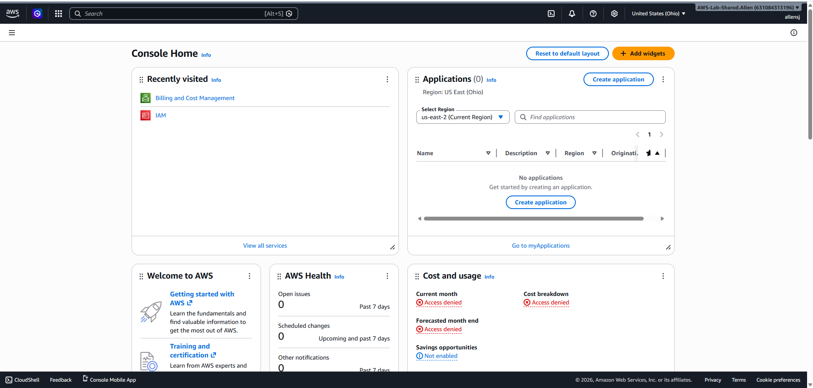
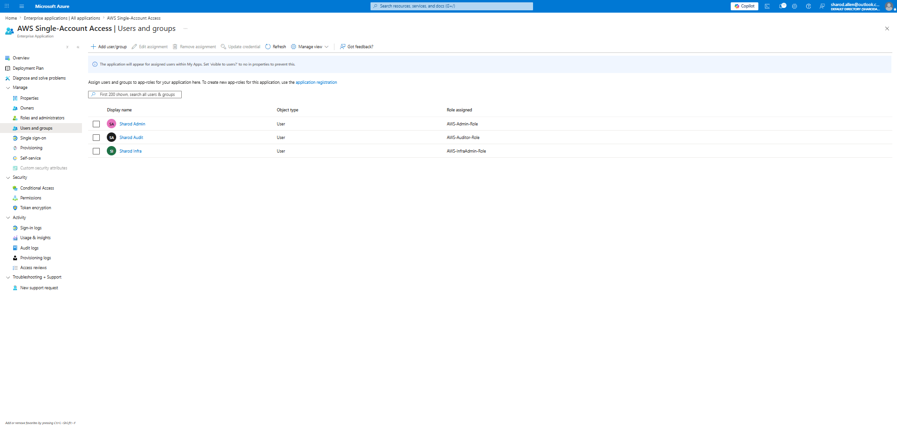
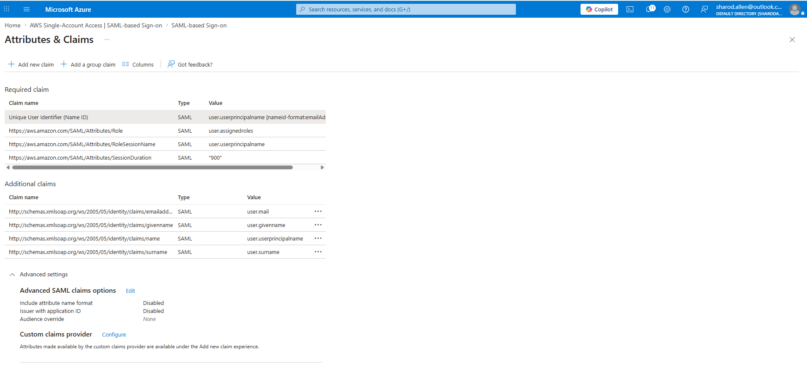

# AWS + Microsoft Entra ID SAML Federation Lab

## Overview

This project demonstrates enterprise identity federation between Microsoft Entra ID (Azure AD) and Amazon Web Services (AWS) using SAML 2.0 authentication.

The lab implements:
- Federated authentication
- Role-Based Access Control (RBAC)
- AWS IAM role assumption
- Microsoft Entra enterprise application integration
- Least privilege access separation
- Temporary AWS credentials through SAML federation

This environment simulates how enterprises centralize authentication using an Identity Provider (IdP) while maintaining granular authorization inside AWS.

---

# Architecture

```text
User
  ↓
Microsoft Entra ID
  ↓ SAML Assertion
AWS IAM Identity Provider
  ↓
AWS IAM Roles
  ↓
AWS Console Access
```

---

# Technologies Used

- Microsoft Entra ID
- AWS IAM
- SAML 2.0
- AWS IAM Roles
- AWS Identity Providers
- RBAC
- Cloud Security Concepts

---

# Objectives

The objectives of this lab were to:

- Configure SAML federation between Entra ID and AWS
- Implement role-based access controls
- Create separate AWS roles for:
  - Administrators
  - Infrastructure Engineers
  - Auditors
- Assign Entra users to AWS roles
- Validate SSO authentication into AWS
- Troubleshoot invalid SAML response errors

---

# AWS Configuration

## IAM Identity Provider

Configured AWS IAM to trust Microsoft Entra ID as a SAML Identity Provider.

### Identity Provider
```text
Provider Name: EntraID
Type: SAML
```

---

# AWS IAM Roles

Created the following AWS IAM roles:

| Role | Purpose |
|---|---|
| AWS-Admin-Role | Full administrative access |
| AWS-InfraAdmin-Role | Infrastructure administration |
| AWS-Auditor-Role | Read-only auditing access |

---

# IAM Policies

## AWS-Admin-Role
Attached Policies:
- AdministratorAccess

## AWS-InfraAdmin-Role
Attached Policies:
- PowerUserAccess
- CloudWatchFullAccess

## AWS-Auditor-Role
Attached Policies:
- ReadOnlyAccess
- SecurityAudit

---

# Microsoft Entra ID Configuration

## Enterprise Application

Created Enterprise Application:
```text
AWS Single-Account Access
```

Configured:
- SAML-based authentication
- AWS sign-on URL
- SAML claims
- Role assignments

---

# User Assignments

| User | Assigned Role |
|---|---|
| Sharod Admin | AWS-Admin-Role |
| Sharod Infra | AWS-InfraAdmin-Role |
| Sharod Audit | AWS-Auditor-Role |

---

# SAML Claims Configuration

Configured required AWS SAML claims:

| Claim | Value |
|---|---|
| Role | user.assignedroles |
| RoleSessionName | user.userprincipalname |
| SessionDuration | 900 |

---

# Troubleshooting

## Issue: Invalid SAML Response

### Root Cause
The SAML Role claim was incorrectly formatted during initial configuration.

### Resolution
Configured the Role claim to properly use:
```text
user.assignedroles
```

and mapped Entra application roles correctly to AWS IAM role ARNs.

---

# Validation

## Successful Federated AWS Login



## Microsoft Entra Role Assignments



## SAML Claims Configuration Screenshot



Validated:
- SAML authentication
- AWS role assumption
- RBAC separation
- Console access
- Federated identity flow

---

# Security Concepts Demonstrated

- Federated Identity Management
- SAML 2.0 Authentication
- Least Privilege Access
- RBAC
- Temporary Credentials
- Identity Federation
- Cloud Access Governance

---

# Future Enhancements

Planned enhancements include:
- AWS CloudTrail integration
- CloudWatch logging
- GuardDuty
- AWS Config
- MFA Conditional Access Policies
- Multi-account federation
- Infrastructure as Code (Terraform)

---

# Lessons Learned

- Proper SAML claim formatting is critical
- Role ARN formatting must match exactly
- Enterprise applications require both:
  - App role definitions
  - User/group assignments
- Federation troubleshooting requires validating both IdP and SP configurations

---

# Author

Sharod Allen

GitHub:
https://github.com/sja32
